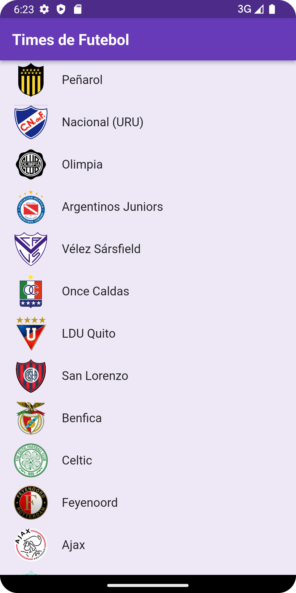
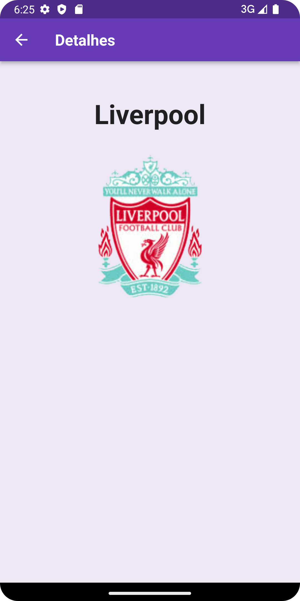

# App Times de Futebol

Projeto desenvolvido com o objetivo de consumir uma api externa e mostrar os dados na tela. Pós
Graduação WEBDEV / Desenvolvimento com Flutter.

## Imagem do App

## [LINK DA API](http://controle.mdvsistemas.com.br/Esportes/Times/GetTime)